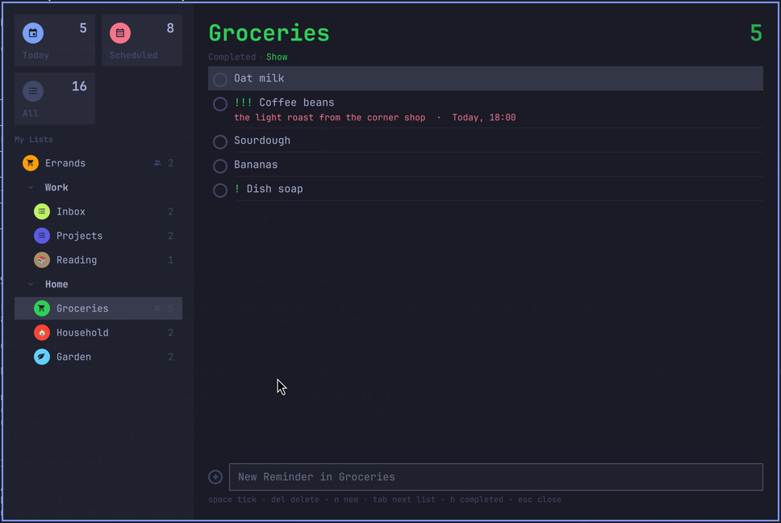
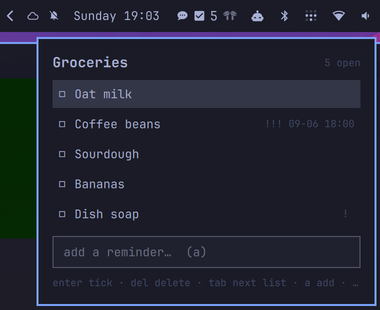

# tikk

**Tick your Apple Reminders from Linux.** A bar pill, a keyboard panel and a
Reminders.app-style window for [Omarchy](https://omarchy.org), talking to a
Mac you own over one tightly confined SSH key.

> Status: in daily use on the author's desk. Gateway measured and stable;
> plugin in its first weeks. Issues and feedback welcome.

<p align="center">
  
</p>
<p align="center">
  
</p>

*Screenshots use the bundled demo fixture (`scripts/demo/fixture.json`); set
`"demo": "/path/to/fixture.json"` on the widget's `shell.json` entry to run
the UI without a Mac.*

## Why a Mac is in the loop

iCloud Reminders have had no server API since the 2019 "upgrade": they live
in a private CloudKit store that only Apple's own frameworks can reach, and
CalDAV stopped seeing them. So tikk does the only thing that works: a Mac
answers a restricted SSH key and runs the verbs for you through EventKit.
The Mac syncs to iCloud, iCloud syncs to your phone.

```
Omarchy ──ssh (one key, verbs only)──▶ Mac gateway ──EventKit──▶ Reminders ──iCloud──▶ iPhone, iPad, …
```

**Scope:** remote control plus a mirror, not two-way sync. You list, add,
complete, uncomplete and delete. Conflict resolution and offline queues are
deliberately out of scope. Writes only ever happen on your keypress.

## What you get

- **Pill** in the bar: `☑ 5`, the open reminders in the list you choose.
  Dims when the Mac is unreachable. Left-click panel, double-click window,
  middle-click refresh.
- **Panel** under the bar: one list, keyboard first. Up/Down or `j`/`k`,
  Enter or click ticks off, Delete deletes, `a` or `/` adds, Tab cycles
  lists, Esc closes.
- **Window** laid out like Reminders.app: Today / Scheduled / All tiles,
  your lists in their groups with their own colours and emblems, the list
  title in its colour, tick circles, notes and due dates, a foldable
  completed section, a New Reminder row. Space or Enter ticks, Delete
  deletes, `n` new, Tab next list, `h` completed, Esc closes.
- **IPC** for keybinds and scripts: `toggle`, `app`, `add`, `complete`,
  `refresh`, `status`.

Keypress to done-on-the-Mac: 0.1–0.4 s (0.6–0.9 s for a shared list).
Everything is drawn from Omarchy's theme tokens, so it follows your theme.

## Install

### 1. The Mac (gateway)

Requirements: macOS with Reminders signed into iCloud, Remote Login on,
[reminders-cli](https://github.com/keith/reminders-cli)
(`brew install keith/formulae/reminders-cli`), Python 3 (Xcode CLT is enough).

Copy `gateway/tikk-dispatch` and `gateway/tikk-reminders` to `~/.tikk/bin/`
on the Mac and make them executable.

On the Linux box, make a dedicated key and enroll it on the Mac, confined to
the dispatcher and to your Linux box's address:

```sh
ssh-keygen -t ed25519 -f ~/.ssh/tikk_ed25519 -N ""
```

```
# ~/.ssh/authorized_keys on the Mac
restrict,command="$HOME/.tikk/bin/tikk-dispatch",from="<linux-box-ip>" ssh-ed25519 AAAA… tikk@linux-box
```

`restrict` turns off pty, forwarding, X11 and agent; `command=` means the key
can run tikk verbs and nothing else, whatever the client asks for.

**Grant access once.** Run `ssh -i ~/.ssh/tikk_ed25519 user@mac check`.
If it reports missing Reminders access, trigger macOS's prompt from any SSH
session on the Mac:

```sh
osascript -e 'tell application "Reminders" to get name of lists'
```

A dialog appears **on the Mac's screen** (use Screen Sharing if it is
headless): allow `sshd-keygen-wrapper` to control Reminders. On current
macOS this also records the Reminders data grant that EventKit needs, and
`check` turns green. macOS grants this to *every* SSH session on that Mac,
not just the tikk key; that is macOS's granularity, not ours.

### 2. Omarchy (client)

Install the shim and tell it where the Mac is:

```sh
install -m 755 bridge/linux/tikk-shim ~/.local/bin/tikk
mkdir -p ~/.config/tikk
printf 'host = user@mac-hostname-or-ip\nkey  = ~/.ssh/tikk_ed25519\n' > ~/.config/tikk/bridge.conf
tikk check          # should answer from the Mac
```

Install the plugin and put it on the bar:

```sh
omarchy plugin add https://github.com/Fileri/tikk.git --enable
```

Add `{ "id": "fileri.tikk", "list": "Groceries" }` to `bar.layout.right` in
`~/.config/omarchy/shell.json` and run `omarchy-restart-shell`. Leave `list`
empty to take the first list the Mac reports.

Suggested Hyprland config (`~/.config/hypr/hyprland.lua` and `bindings.lua`)
so the window floats centred and stays on top, with keys for both surfaces:

```lua
o.window({ class = "^org.quickshell$", title = "^tikk$" }, { float = true, center = true, pin = true, size = { 960, 640 } })
o.bind("SUPER + R", "tikk reminders", "qs -p /usr/share/omarchy/shell ipc call fileri.tikk app")
o.bind("SUPER + CTRL + R", "tikk panel", "omarchy-shell shell toggle fileri.tikk")
```

## The verbs

Everything the plugin does is one of these, and you can use them from a
shell too:

```sh
tikk lists
tikk show Groceries [--all | --done] [--json]
tikk add Groceries "Oat milk" [--body "…"] [--due 2026-09-10 | --due "2026-09-10 18:00"] [--priority 0|1|5|9]
tikk complete Groceries "Oat milk"        # id or exact name; ambiguous names are refused
tikk uncomplete Groceries <id>
tikk delete Groceries <id>
tikk snapshot --json                      # every list + every open reminder, one round trip
tikk check                                # is the Mac answering, is the grant in place
```

`--json` works everywhere. Priorities use Reminders' own scale (none, high,
medium, low). Exit codes follow `sysexits.h`: 64 usage, 65 ambiguous, 66 not
found, 69 gateway or backend failure, 77 no permission, 78 tool missing.

`snapshot` also carries what EventKit does not expose: Reminders.app's list
**groups**, each list's **colour**, emblem and shared flag, read from
Reminders' own store on the Mac (on a copy, read-only, never written). That
needs the SSH session to have Full Disk Access; without it you get a flat
list of lists and everything else still works.

## Security model

- The Linux box holds one key that can only run the verbs above: no shell,
  no file transfer, no forwarding. Anything else is refused with exit 64.
- `tikk-dispatch` splits the command with shell quoting rules and `exec`s
  the verb tool directly; no shell is ever involved on the Mac.
- The verb tool finds `reminders` in fixed locations and runs with a fixed
  system `PATH`.
- Nothing about your reminders is stored on the Linux side.

## Why EventKit and not AppleScript

`gateway/tikk-reminders-applescript` is the same interface driven through
Reminders.app with osascript. It works and needs no install on the Mac, but
on macOS 26 every `make new reminder` takes about 28 seconds (Reminders.app
spins on its main thread after the save and answers nothing else meanwhile),
every change to a shared list takes as long, and AppleScript only sees the
default account's lists. EventKit does all of it in a fraction of a second
and does not need Reminders.app running. The file stays as a documented
dead end and a fallback.

## Credits

The gateway pattern (a Mac behind a forced-command key, a thin Linux client)
is borrowed from [blip](https://github.com/nixfred/blip), iMessage for
Omarchy. The EventKit work is done by
[reminders-cli](https://github.com/keith/reminders-cli).

## License

MIT.
